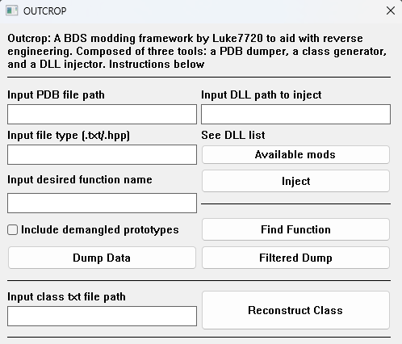

# outcrop-final
Outcrop is a windows Bedrock Dedicated Server reverse engineering and modding toolkit. This started as a few separate 
projects, most for my eyes only, but with this I aim to make my tools usable for anyone. Outcrop includes the following:

- A PDB (Program DataBase) file dumper
- A DLL (Dynamic Link Library) injector
- A class reconstructor from IDA (Interactive DisAssembler) data

## Dependencies
- [cc 1.0](https://crates.io/crates/cc)
- [injrs 0.1.2](https://crates.io/crates/injrs)
- [md5 0.7.0](https://crates.io/crates/md5)
- [native-windows-gui 1.0.12](https://crates.io/crates/native-windows-gui)
- [native-windows-derive 1.0.3](https://crates.io/crates/native-windows-derive)
- [pdb 0.8.0](https://crates.io/crates/pdb)
- [subprocess 0.2.9](https://crates.io/crates/subprocess)

## User Interface

<p align="center">
  
</p>

## Usage
### PDB Dumper
A PDB dumper is a tool that extracts "symbols" from a PDB file. Symbols can include mangled (encoded) function 
prototypes (which can be 'demangled' to obtain a function prototype) and RVAs (Relative Virtual Addresses). This PDB
dumper, which was inspired by [Player]'s dumper, can dump PDB data, find specific functions, and provide partial PDB
dumps.

**Full dumping**: Input the pdb file path and the file type and then click the 'Dump Data' button which will create a 
SymHook file in the project/executable directory. The latter can be either a text (.txt) or a C++ header (.hpp) file; 
input the desired file extension to determine this. The C++ header mode uses the mangled function prototype md5 hashes
as variable names and can be used as-is for BDS DLL modding through function hooking.

**Partial/Filtered Dumping**: Upon startup for the first time, BDumper creates a file with the name 'dumpFilter.txt' if
it cannot find it. This file will hold the functions to be dumped in this mode. BDumper will ignore lines starting with 
'#' (which are considered comments) and newlines. An example:

```
# Dump Filter Example
# This is a comment, BDumper ignores lines starting with '#' and empty lines

OceanMonumentFeature::isFeatureChunk
FossilFeature::place
PistonBlock::canSurvive
PistonBlockActor::_attachedBlockWalker
BlockSource::getSeenPercent
```

**Find Function**: If you need to quickly hook into a function or update an RVA, this function can find an individual 
function with the same method the filtered dump uses. Input the function name (PistonBlockActor::_checkAttachedBlocks as
an example) and click on the 'Find Function' button. A window will pop up with the symbol and RVA if the function exists.

### DLL Injector
A DLL injector is a tool which forces a process to load a Dynamic Link Library into itself. This is useful to run code
inside a process, and for game hacking and BDS modding which use function hooking/detouring to change BDS code. To
inject a mod into the BDS process, first go to the BDS root folder and create a folder with the name `plugins`. Place
your mod there and input the path to it. If you want to see all available DLLs inside the plugins folder, the outcrop
executable should be placed inside the BDS folder.

### IDA Class Reconstructor
This tool was made to generate C++ headers to interface with BDS classes using no Mojang code. It was made to work with
data extracted from 1.6 Windows BDS, but it should work with other versions. 

To use this, a file named `class.txt` must be created. This file will be divided into 2 sections, `=====DECLA=====` and 
`=====INMEM=====`, having `=====ENDSF=====` at the end of the file. Between the first 2 'delimiters', paste the struct 
declaration. You can easily get this by opening the IDA 'Local Types' window, right-clicking on a struct and going to 
the 'edit' section. Copy-paste the contents. Between the last 2 paste the class memory layout which you can easily get 
by opening the structs window and clicking on whichever struct you need (you can use Ctrl+F to find them in both 
windows), or double-clicking on the struct you want in the local types window. Copy-paste the memory layout.

Once this is done, input the `class.txt` path and click on the 'Reconstruct Class' button. A file named `class.hpp`
will be created.

With `class.txt` looking like this:

```
=====DECLA=====
const struct __cppobj __declspec(align(8)) Block
{
  Block_vtbl *__vftable /*VFT*/;
  const unsigned __int8 mData;
  const BlockLegacy *mLegacyBlock;
  CompoundTag mSerializationId;
  unsigned int mRuntimeId;
};
=====INMEM=====
00000000 Block           struc ; (sizeof=0x38, align=0x8, copyof_8232)
00000000                                         ; XREF: ?_sendLevelData@ServerNetworkHandler@@AEAAXAEAVServerPlayer@@AEBVNetworkIdentifier@@@Z/r
00000000 __vftable       dq ?                    ; XREF: ServerNetworkHandler::_sendLevelData(ServerPlayer &,NetworkIdentifier const &)+48/w
00000000                                         ; ServerNetworkHandler::_sendLevelData(ServerPlayer &,NetworkIdentifier const &):loc_14011CDB1/r ... ; offset
00000008 mData           db ?                    ; XREF: ServerNetworkHandler::_sendLevelData(ServerPlayer &,NetworkIdentifier const &)+263/o
00000008                                         ; ServerNetworkHandler::_sendLevelData(ServerPlayer &,NetworkIdentifier const &)+4EE/r ...
00000009                 db ? ; undefined
0000000A                 db ? ; undefined
0000000B                 db ? ; undefined
0000000C                 db ? ; undefined
0000000D                 db ? ; undefined
0000000E                 db ? ; undefined
0000000F                 db ? ; undefined
00000010 mLegacyBlock    dq ?                    ; XREF: ServerNetworkHandler::_sendLevelData(ServerPlayer &,NetworkIdentifier const &)+747/w
00000010                                         ; ServerNetworkHandler::_sendLevelData(ServerPlayer &,NetworkIdentifier const &)+751/w ... ; offset
00000018 mSerializationId CompoundTag ?          ; XREF: ServerNetworkHandler::_sendLevelData(ServerPlayer &,NetworkIdentifier const &):loc_14011D01E/r
00000018                                         ; ServerNetworkHandler::_sendLevelData(ServerPlayer &,NetworkIdentifier const &)+75B/w ...
00000030 mRuntimeId      dd ?                    ; XREF: ServerNetworkHandler::_sendLevelData(ServerPlayer &,NetworkIdentifier const &)+78C/w
00000030                                         ; ServerNetworkHandler::_sendLevelData(ServerPlayer &,NetworkIdentifier const &)+80C/w ...
00000034                 db ? ; undefined
00000035                 db ? ; undefined
00000036                 db ? ; undefined
00000037                 db ? ; undefined
00000038 Block           ends
=====ENDSF=====
```

...the output (`class.hpp`) should contain the following:

```cpp
class Block
{
public:
	auto getData() -> const unsigned __int8 {
		return *reinterpret_cast<const unsigned __int8>(reintepret_cast<VA>(this) + 0x8); 
	}
	auto getLegacyBlock() -> const BlockLegacy *{
		return reinterpret_cast<const BlockLegacy *>(reintepret_cast<VA>(this) + 0x10); 
	}
	auto getSerializationId() -> CompoundTag {
		return *reinterpret_cast<CompoundTag>(reintepret_cast<VA>(this) + 0x18); 
	}
	auto getRuntimeId() -> unsigned int {
		return *reinterpret_cast<unsigned int>(reintepret_cast<VA>(this) + 0x30); 
	}
	auto setData(const unsigned __int8  param_1) -> void {
		*reinterpret_cast<const unsigned __int8>(reintepret_cast<VA>(this) + 0x8) = param_1;
	}
	auto setLegacyBlock(const BlockLegacy * param_1) -> void {
		reinterpret_cast<const BlockLegacy *>(reintepret_cast<VA>(this) + 0x10) = param_1;
	}
	auto setSerializationId(CompoundTag  param_1) -> void {
		*reinterpret_cast<CompoundTag>(reintepret_cast<VA>(this) + 0x18) = param_1;
	}
	auto setRuntimeId(unsigned int  param_1) -> void {
		*reinterpret_cast<unsigned int>(reintepret_cast<VA>(this) + 0x30) = param_1;
	}
};
```

## Special Thanks
- ! Pixel
- [Player]
- AgNO3